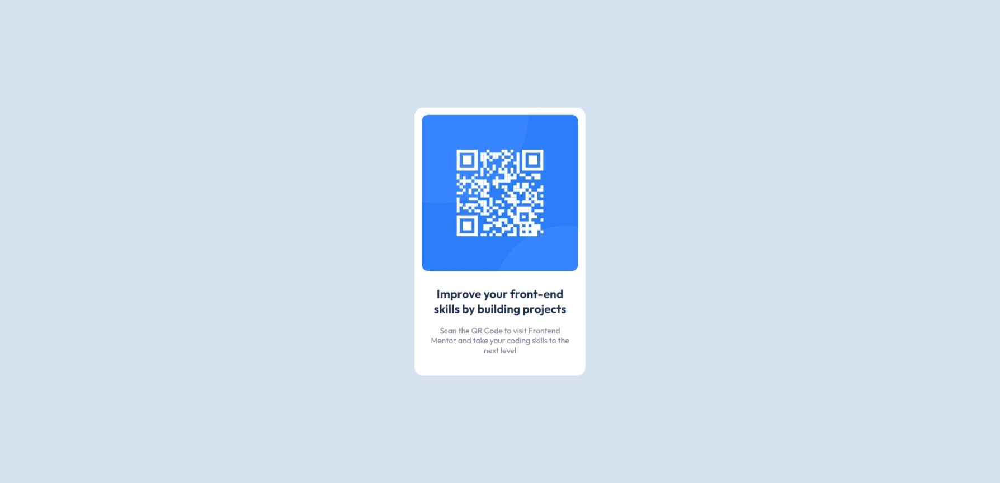
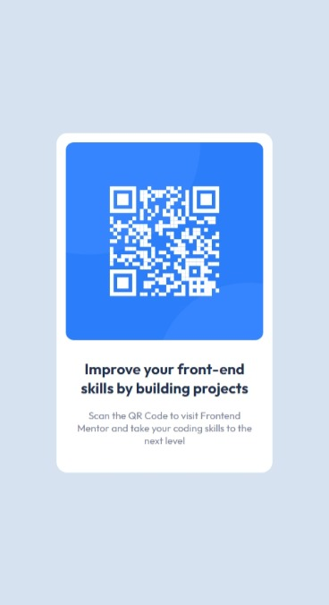
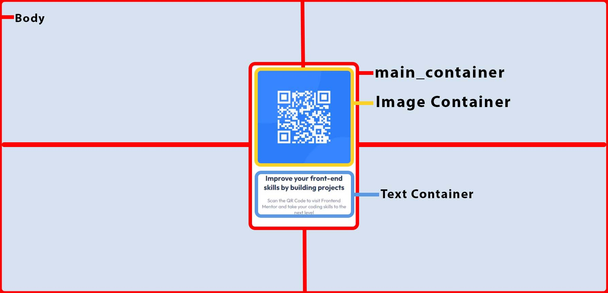
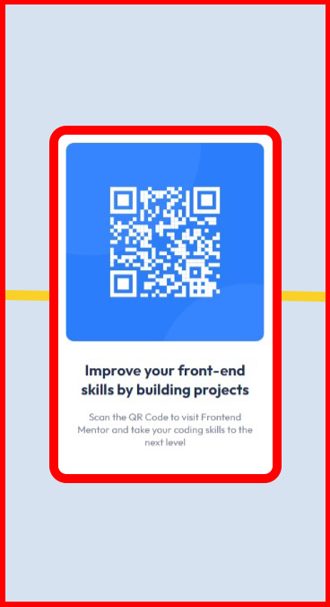

# Frontend Mentor - QR code component solution



This is a solution to the [QR code component challenge on Frontend Mentor](https://www.frontendmentor.io/challenges/qr-code-component-iux_sIO_H). Frontend Mentor challenges help you improve your coding skills by building realistic projects. 

## Table of contents

- [Overview](#overview)
  - [Screenshot](#screenshot)
  - [Links](#links)
- [My process](#my-process)
  - [Built with](#built-with)
  - [What I learned](#what-i-learned)
  - [Useful resources](#useful-resources)
- [Author](#author)
- [Acknowledgments](#acknowledgments)


## Overview

QR Code Component Challenge on Frontend Mentor is the basic and entry level challenge for begginer having knowledge of HTML and CSS. Check out the [GitHub Repo](https://github.com/ravindra135/qr-code-componet-frontend-mentor) for complete source code. Thank You.!!!

### Screenshots


**#2 - Full Desktop Version:**


**#3 - MOBILE VERSION**




<!--  -->


### Links

- Solution URL: [GitHub Repo](https://github.com/ravindra135/qr-code-componet-frontend-mentor)
- Live Site URL: [CHECK LIVE HERE](https://ravindra135.github.io/qr-code-componet-frontend-mentor/)

## My process

### Built with

- HTML5
- CSS
- Flexbox

### What I learned

Some of the major key points learnings while working through this project:

**#1 - Sections in this Project**

-> Have a look at the image below:



**#2 - For Styles refer to the style.css file**

-> How to center the main-container(element) div, many of beginners stuck here, and also this is the mostly asked question in Interviews; have a look at this code snippet

```css
body {
    background-color: hsl(212, 45%, 89%); 
    min-height: 100vh;
    display: flex;
    align-items: center;
    font-size: 15px;
}
```

one can center div, in many ways my perference is using the display as flex. Learning about Flexbox was really fun.

**#3 - Mobile Version**

-> When you open this mobile version you may see, the card component is streched to the ends of display port, so to solve this, simple we add margins to the card component;

```css
.card {
    ...
    margin: 0 1rem;
    /* 0 = Top and Bottom (Vertical) */
    /* 1rem = Right and Left (Horizontal)  */
}
```

; So as we need Right and Left to have some gap, we only added 1rem to the both sides



**Leave a Message with your questions and Suggestions. All are welcome!!!**

### Useful resources

- [WS3 School](https://www.w3schools.com/) - This helped with some of the CSS Property like
```css
min-height: 100vh;
-----
display: flex;
```

## Author

- Frontend Mentor - [@ravindra135](https://www.frontendmentor.io/profile/ravindra135)
- Github - [@ravindra135](https://github.com/ravindra135/)
- Instagram - [@ravindra_since2k](https://www.instagram.com/ravindra_since2k/)


## Acknowledgments

I would really thank you [KEVIN POWELL](https://www.youtube.com/kepowob), for his wonderfull suggestion on giving a shot to Frontend Mentor. I think it worked for me. As, being a Backend Developer I wanted to go for Full-Stack so, I really need a strong hold on Advanced CSS. Frontend Mentor is really good to have a  realtime practice session on-the-go.